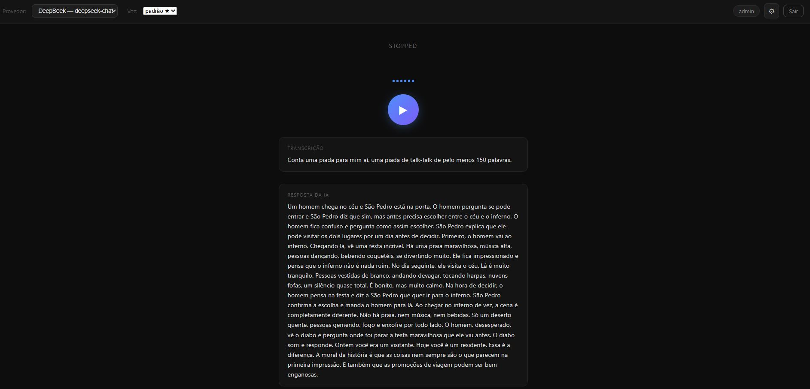
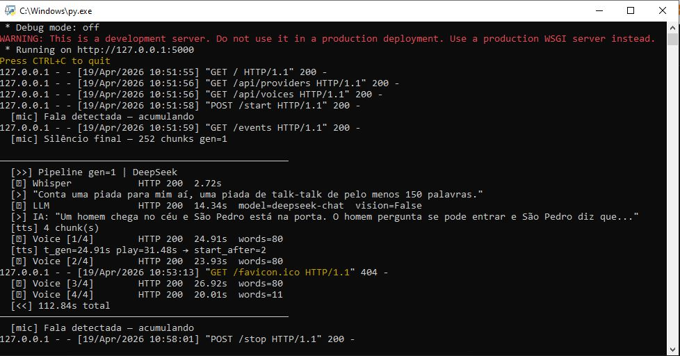

<p align="center">
  
</p>

# VozIA — Assistente de Voz com IA em Tempo Real

Assistente de voz em tempo real com detecção de atividade vocal (VAD), transcrição via Whisper, resposta via LLM e síntese de voz via API de conversão de voz. Interface web com autenticação, painel admin e suporte a múltiplos provedores de IA.

---

## ✨ Funcionalidades

- **VAD com Silero** — detecta automaticamente quando o usuário começa e termina de falar, acumulando o áudio entre pausas curtas e enviando apenas ao detectar silêncio sustentado (~1.8s)
- **Whisper** — transcrição do áudio capturado (modelo configurável)
- **Multi-provider LLM** — suporte a OpenAI, DeepSeek, Anthropic, Google Gemini, Moonshot, MiniMax, OpenRouter, Ollama e qualquer API compatível com OpenAI
- **Vision** — captura screenshot da tela e envia junto com a pergunta (flag `VISION=yes` no `.env`)
- **Voice conversion com streaming** — converte a resposta da IA em áudio e reproduz em chunks progressivos, com algoritmo adaptativo de buffer (veja detalhes abaixo)
- **Gerenciamento de vozes** — upload de arquivos em qualquer formato (mp3, mp4, ogg, flac…), convertidos automaticamente para WAV
- **SSE** — eventos em tempo real (status, transcrição, resposta, áudio) para o frontend
- **Autenticação** — login com sessão; suporte a múltiplos usuários
- **Painel Admin** — gerenciamento de configurações, provedores, vozes e usuários via interface web

---

## 📁 Estrutura

```
real-time/
├── app.py              # Servidor Flask principal
├── db.py               # Helpers de banco de dados
├── init_db.py          # Inicialização do banco (cria schema + seed)
├── voices/             # Arquivos WAV de referência para síntese de voz
├── imagens/            # Screenshots do projeto (README)
├── templates/
│   ├── index.html      # Interface principal
│   └── login.html      # Tela de login
├── .env                # Variáveis de ambiente
├── requirements.txt
├── Dockerfile
└── docker-compose.yml
```

---

## 🖼️ Screenshots

**Tela inicial**



**Console (pipeline de áudio)**



---

## 🚀 Como rodar

### Pré-requisitos

- Python 3.11+
- MySQL 8.0+ (usuário `acore`, senha `acore`, banco `voice_assistant`)
- **ffmpeg** instalado no PATH (necessário para conversão de formatos de áudio via pydub)
- Microfone conectado
- Arquivo de áudio de referência para síntese de voz (`.wav`) — gerenciável pelo painel admin

### 1. Instalar dependências

```bash
pip install -r requirements.txt
```

### 2. Configurar `.env`

```env
DB_HOST=localhost
DB_PORT=3306
DB_USER=acore
DB_PASS=acore
DB_NAME=voice_assistant
SECRET_KEY=troque-aqui
VISION=no
```

### 3. Inicializar o banco

```bash
python init_db.py
```

Isso cria o banco, tabelas e usuários/provedores/configurações padrão.

**Usuários padrão:**
| Usuário | Senha | Tipo  |
|---------|-------|-------|
| admin   | admin | Admin |
| user    | user  | Normal|

### 4. Iniciar o servidor

```bash
python app.py
```

Acesse `http://localhost:5000` no navegador.

---

## 🐳 Docker

```bash
docker-compose up --build
```

O compose sobe o MySQL e a aplicação automaticamente. O banco é inicializado na primeira execução.

> **Nota:** O acesso ao microfone em container requer que o host seja Linux com `/dev/snd` disponível. No Windows/macOS, rode a aplicação localmente.

---

## ⚙️ Painel Admin

Faça login com o usuário `admin` e clique no ícone ⚙ no canto superior direito.

### Aba Configurações
Todas as configurações das APIs são editáveis:
- **Whisper:** URL, usuário, senha, modelo
- **Voice API:** URL, caminho do áudio de referência, `num_step`, velocidade
- **VAD:** threshold de detecção, chunks de silêncio para encerrar
- **LLM:** tokens máximos, temperatura, system prompt

### Aba Provedores
Gerencie os provedores de LLM. Provedores pré-cadastrados:
- OpenAI, DeepSeek, Anthropic, Google Gemini, Moonshot, MiniMax, OpenRouter, Ollama, Outros/LM Studio

Cada provedor tem: nome, URL base, API key, modelo, flag de visão e flag de ativo (apenas provedores ativos aparecem na seleção).

### Aba Vozes
Gerencie os arquivos de voz de referência usados na síntese TTS:
- Faça upload de qualquer formato de áudio (`.wav`, `.mp3`, `.mp4`, `.ogg`, `.flac`, `.m4a`…)
- O arquivo é **convertido automaticamente para WAV** via pydub/ffmpeg e salvo em `voices/`
- Defina qual voz é o **padrão do sistema**
- A voz pode ser trocada na interface principal em tempo real (reinicia o pipeline automaticamente)

### Aba Usuários
Crie, edite e remova usuários. Defina o papel (admin ou normal).

---

## � Streaming de áudio com buffer adaptativo

Quando a IA retorna uma resposta longa, o sistema **não espera gerar todo o áudio** antes de reproduzir. Em vez disso:

1. O texto é dividido em **chunks de 80 palavras**
2. Cada chunk é enviado à Voice API individualmente
3. O **primeiro chunk** é gerado e seu tempo de geração (`t_gen`) é medido
4. A duração real do áudio WAV retornado é extraída do header do arquivo
5. O número de chunks a pré-carregar antes de iniciar a reprodução é calculado:

```
start_after = ceil(t_gen / play_duration) + 1
```

**Exemplo:**
| `t_gen` (geração) | `play_duration` (duração do áudio) | `start_after` | Comportamento |
|---|---|---|---|
| 2.0s | 5.0s | 1 | Reproduz o chunk 1 imediatamente — chunk 2 fica pronto antes do 1 terminar |
| 4.0s | 2.0s | 3 | Aguarda 3 chunks no buffer — evita silêncio durante a reprodução |
| 3.0s | 3.0s | 2 | Buffer de 2 chunks |

O valor é calculado dinamicamente a cada resposta e transmitido ao frontend via SSE, garantindo **reprodução contínua sem gaps** independente da velocidade do servidor de voz.

---

## 🔌 APIs utilizadas

| Serviço      | Endpoint padrão | Projeto |
|-------------|-----------------|----------|
| Whisper      | `http://localhost:9222/transcribe` | [lucasnumaboa/Whisper-fastapi](https://github.com/lucasnumaboa/Whisper-fastapi) |
| LLM          | Configurável por provedor | OpenAI-compatible |
| OmniVoice    | `http://localhost:5001/api/v1/voice-conversion` | [lucasnumaboa/OmniVoice-API](https://github.com/lucasnumaboa/OmniVoice-API) |

### Rodando os serviços localmente

**Whisper (transcrição de voz):**
```bash
git clone https://github.com/lucasnumaboa/Whisper-fastapi
cd Whisper-fastapi
# siga o README do projeto
# sobe na porta 9222
```

**OmniVoice (síntese de voz TTS):**
```bash
git clone https://github.com/lucasnumaboa/OmniVoice-API
cd OmniVoice-API
# siga o README do projeto
# sobe na porta 5001
```

---

## 📋 Variáveis de ambiente

| Variável    | Padrão        | Descrição |
|-------------|---------------|-----------|
| `DB_HOST`   | `localhost`   | Host MySQL |
| `DB_PORT`   | `3306`        | Porta MySQL |
| `DB_USER`   | `acore`       | Usuário MySQL |
| `DB_PASS`   | `acore`       | Senha MySQL |
| `DB_NAME`   | `voice_assistant` | Nome do banco |
| `SECRET_KEY`| `change-me`   | Chave de sessão Flask |
| `VISION`    | `no`          | Habilita captura de tela (`yes`/`no`) |

---

## 🛠️ Requisitos técnicos

- `flask`, `pymysql`, `python-dotenv`
- `torch`, `torchaudio` — Silero VAD
- `sounddevice`, `numpy` — captura de áudio
- `requests` — chamadas HTTP
- `Pillow` — screenshots (quando `VISION=yes`)
- `werkzeug` — hash de senhas
- `pydub` + **ffmpeg** — conversão de formatos de áudio para WAV
